# 🔍 AWS CloudWatch - Parte 3/1 | CloudWatch Synthetics (Canary) e CloudWatch RUM

## 📌 Sobre o Vídeo

Após monitorarmos os serviços da aplicação e criarmos dashboards e alarmes no CloudWatch, chegou o momento de acompanhar algo ainda mais importante: a experiência do usuário.

Neste vídeo vamos explorar duas soluções poderosas do Amazon CloudWatch:

* CloudWatch Synthetics (Canary)
* CloudWatch RUM (Real User Monitoring)

Enquanto o Canary simula automaticamente ações realizadas por um usuário, o RUM coleta informações reais de navegação diretamente dos navegadores dos visitantes da aplicação.

O objetivo é identificar problemas que muitas vezes não aparecem apenas através das métricas tradicionais de infraestrutura.

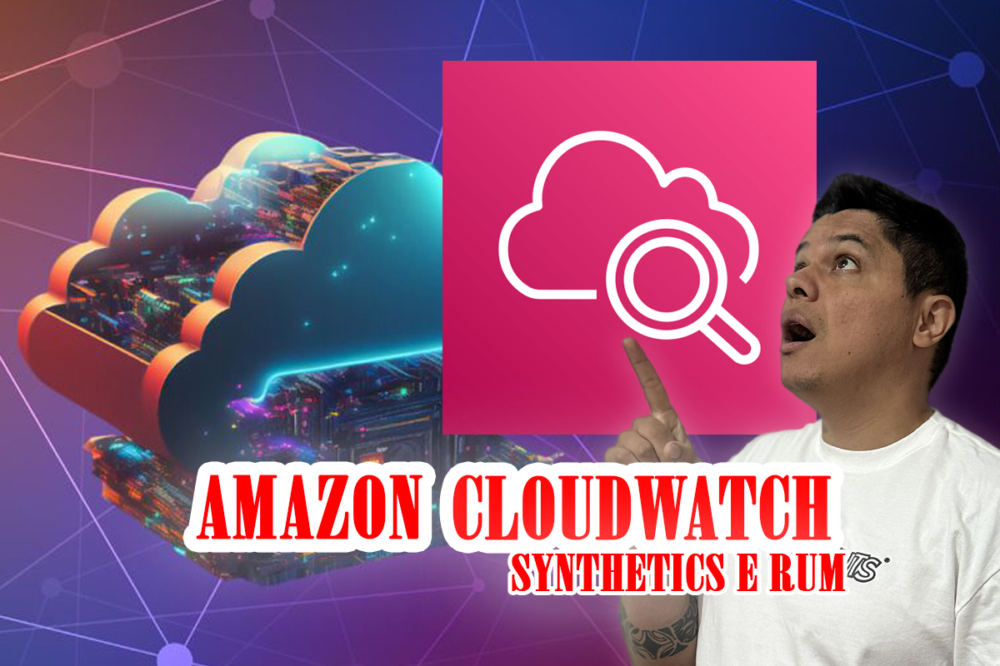
---

## 🎯 Objetivos

Neste vídeo você aprenderá:

✅ O que é CloudWatch Synthetics
✅ O que é CloudWatch RUM
✅ Como criar um Canary
✅ Como automatizar testes de login
✅ Como monitorar disponibilidade da aplicação
✅ Como capturar erros de navegação
✅ Como acompanhar a experiência real dos usuários
✅ Como identificar problemas antes que sejam reportados

---

## 🏗️ Cenário Utilizado

A aplicação utilizada neste projeto é composta pelos seguintes serviços:

* Amazon CloudFront
* Amazon S3
* Amazon API Gateway
* AWS Lambda
* Amazon DynamoDB
* Amazon Route 53

O processo monitorado pelo Canary será o fluxo de autenticação da aplicação.

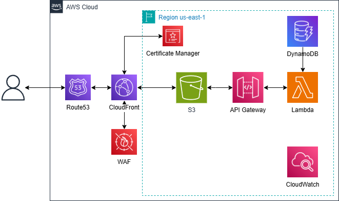

---

## 🔍 CloudWatch Synthetics (Canary)

O CloudWatch Synthetics permite criar scripts automatizados que simulam ações realizadas pelos usuários.

Esses testes são executados periodicamente para validar a disponibilidade e o funcionamento da aplicação.

---

## 🎬 Teste Implementado

Neste projeto foi criado um Canary para:

### Etapas monitoradas

1. Acessar a página de login
2. Preencher usuário
3. Preencher senha
4. Realizar autenticação
5. Validar acesso realizado com sucesso
6. Capturar evidências através de screenshots

---

## 📈 Benefícios do Canary

* Validação automática da aplicação
* Monitoramento contínuo
* Identificação antecipada de falhas
* Captura de screenshots
* Histórico de execuções
* Integração com CloudWatch Alarms

---

## 📊 Métricas Disponíveis

### Disponibilidade

* Success Percent
* Failed Executions
* Total Executions

### Performance

* Duração da execução
* Tempo de carregamento
* Tempo de resposta

### Evidências

* Logs
* Screenshots
* Relatórios detalhados

---

## 👨‍💻 CloudWatch RUM

O CloudWatch RUM (Real User Monitoring) permite monitorar a experiência dos usuários reais que acessam a aplicação.

As métricas são coletadas diretamente dos navegadores dos visitantes.

---

## 📈 Informações Coletadas

### Performance

* Tempo de carregamento da página
* Tempo de renderização
* Tempo de resposta

### Erros

* JavaScript Errors
* Falhas de carregamento
* Problemas de navegação

### Usuários

* Sessões
* Navegações
* Páginas acessadas

---

## 🎯 Benefícios do RUM

* Visão real da experiência do usuário
* Identificação de problemas de performance
* Análise de comportamento
* Monitoramento de erros no navegador
* Apoio na melhoria da experiência digital

---

## 🔄 Comparação

| Recurso                            | CloudWatch Synthetics | CloudWatch RUM |
| ---------------------------------- | --------------------- | -------------- |
| Teste automatizado                 | ✅                     | ❌              |
| Simulação de usuário               | ✅                     | ❌              |
| Usuário real                       | ❌                     | ✅              |
| Captura de erros JavaScript        | ❌                     | ✅              |
| Disponibilidade da aplicação       | ✅                     | ❌              |
| Performance percebida pelo usuário | ❌                     | ✅              |

---

## 🚀 Resultado Final

Ao combinar CloudWatch Synthetics e CloudWatch RUM conseguimos monitorar a aplicação sob duas perspectivas:

### Visão Operacional

Monitoramento automatizado através dos Canaries.

### Visão do Usuário

Experiência real capturada através do RUM.

Essa combinação fornece uma estratégia moderna de observabilidade para aplicações em produção.

---

## 📋 Tecnologias Utilizadas

* Amazon CloudWatch
* CloudWatch Synthetics
* CloudWatch RUM
* Amazon CloudFront
* Amazon S3
* Amazon API Gateway
* AWS Lambda
* Amazon DynamoDB
* Amazon Route 53

---
## 📸 Fotos do Projeto

  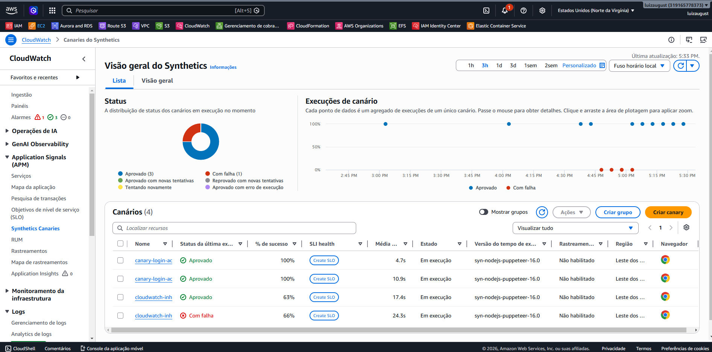
  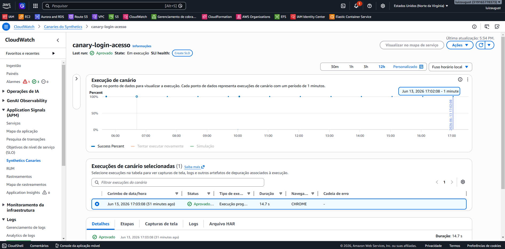
  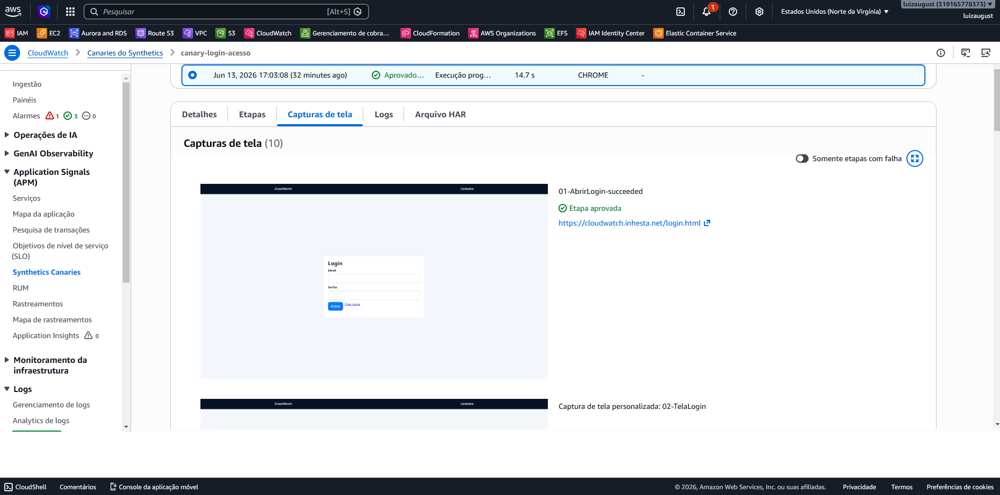

  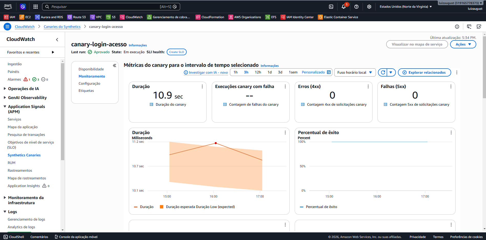
  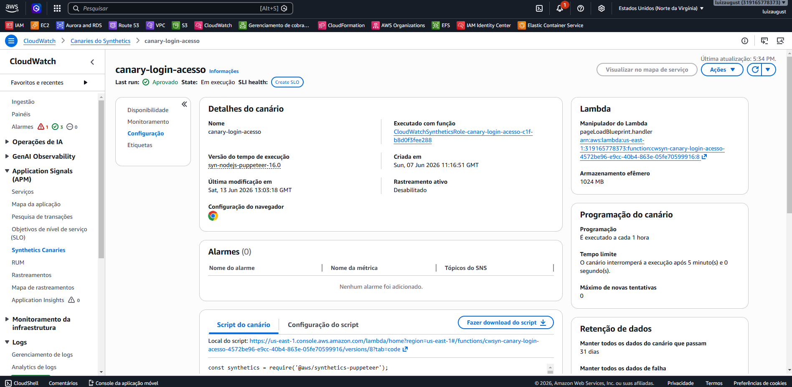
  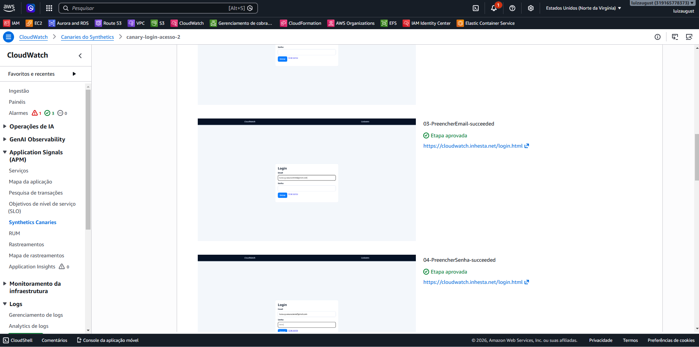

  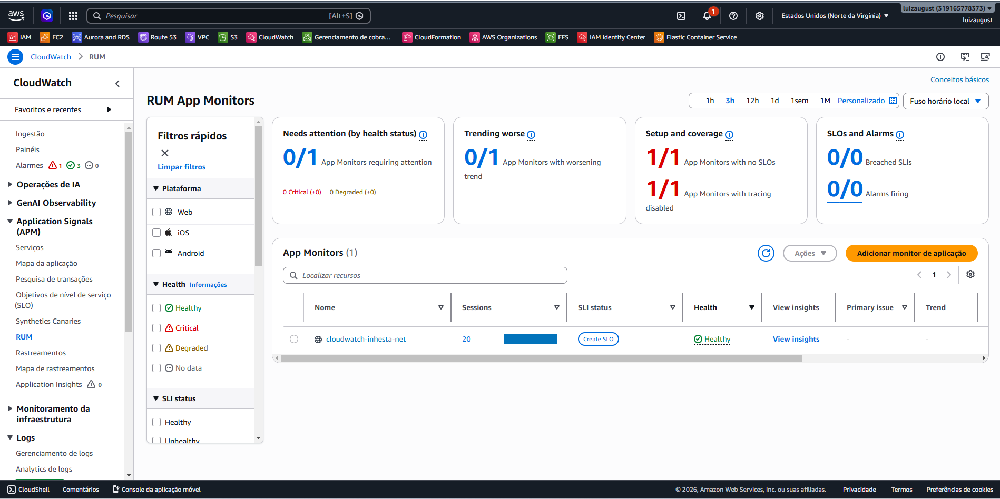
  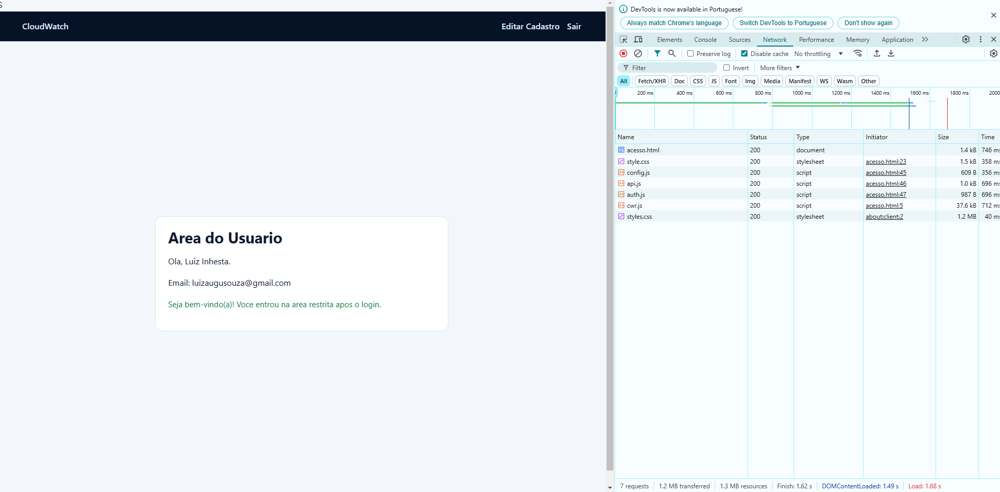
  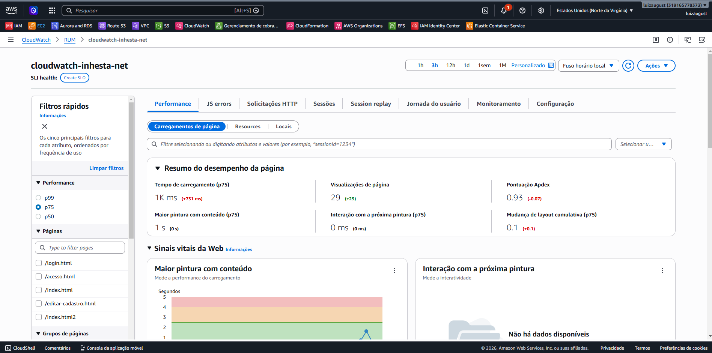

  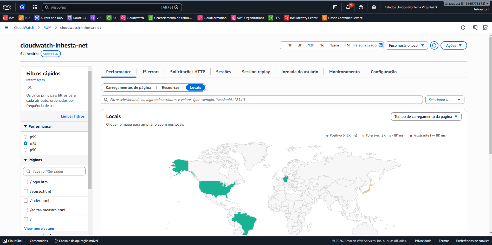
  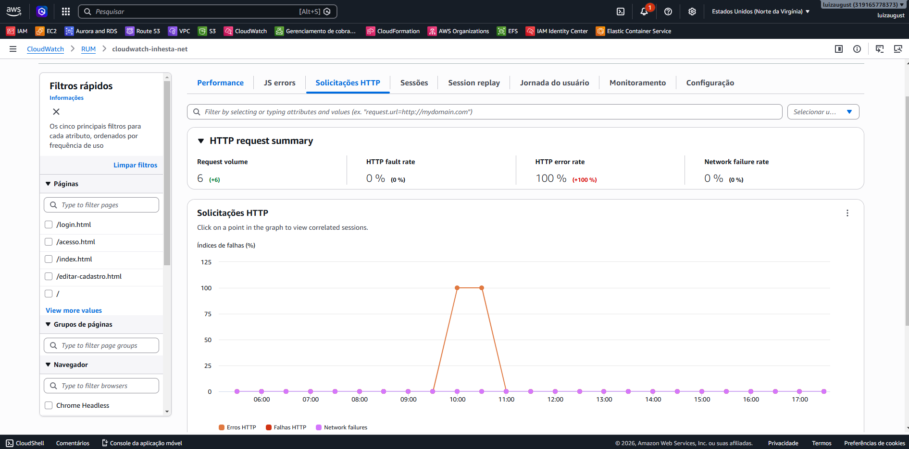

---

## ▶️ Vídeo do Projeto

Youtube: https://youtu.be/uqasa1VahUY

Linkedin: https://www.linkedin.com/in/luiz-inhesta-341b4b311/

---

## 👨‍💻 Autor

**Luiz Augusto Inhesta**

Projeto desenvolvido para estudos, demonstrações práticas e compartilhamento de conhecimento sobre AWS, Observabilidade, Cloud Computing e Monitoramento de Aplicações.
